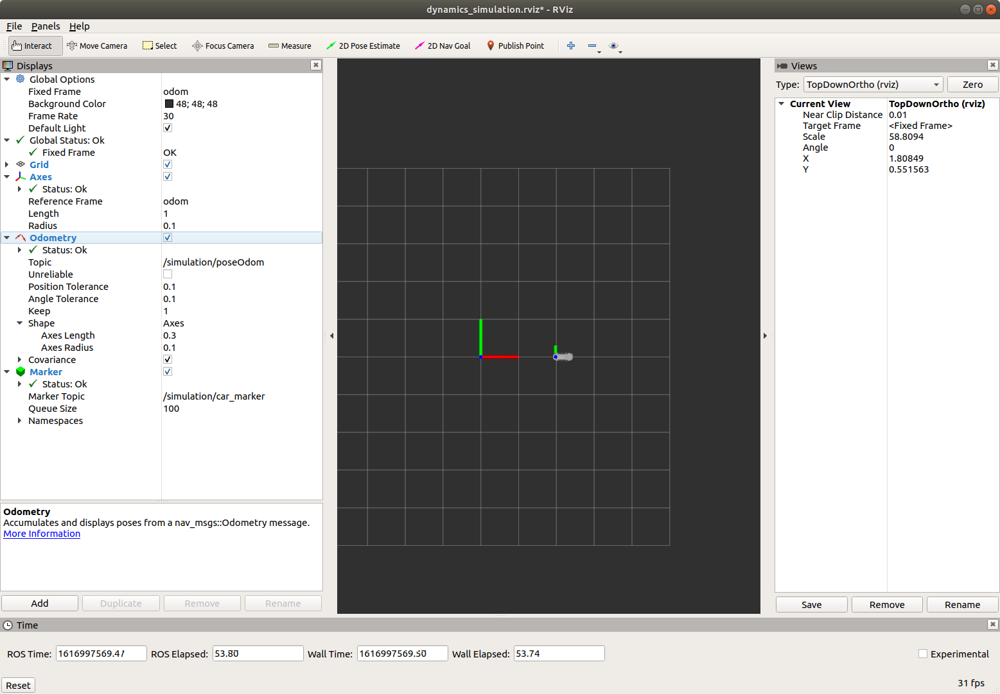
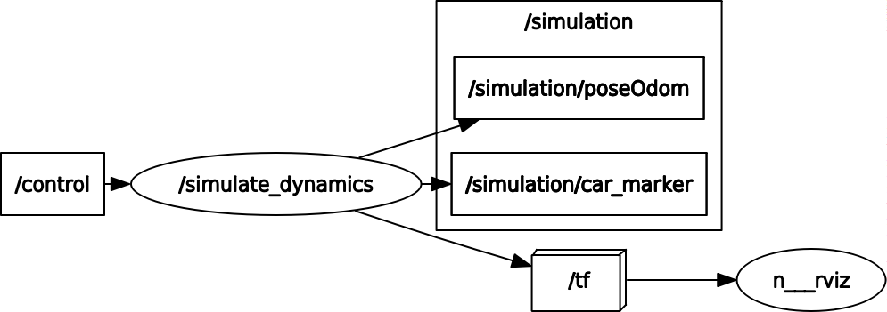

# eurecarr_vehicle_sim

A simple ROS based car dynamics simulator.

## Install ROS

Follow either of the following.

### Official Documentation

`Melodic` with `Ubuntu 18.04` is recommended.\
Reference: http://wiki.ros.org/melodic/Installation/Ubuntu

### Convenience Install Script
Using scripts located at `etc/` of this repository, depending on you Ubuntu version, run

- Ubuntu 18.04
> `sudo chmod 755 ./install_ros_melodic && bash ./install_ros_melodic.sh`
- Ubuntu 16.04
> `sudo chmod 755 ./install_ros_kinetic && bash ./install_ros_kinetic.sh`

Note, aliases are setup in your `~/.bashrc`.\
To edit, run `gedit ~/.bashrc`.

## Download the Code

Copy & paste this package at your catkin workspace (~/catkin_ws).

Run the following command to install all ROS dependencies for the `src/` directory.
```
cd ~/catkin_ws
rosdep install --from-paths src --ignore-src -r -y
```

## Install Python Dependencies

```
pip2 install numpy --user
```
Note, ROS (melodic) runs with `python 2.x`


## Running the Simulator

Open a terminal and launch visualization.
```
roslaunch eurecarr_vehicle_sim simVis.launch
```

In another terminal, run the node.
```
rosrun eurecarr_vehicle_sim simulate_dynamics.py
```

> If the terminal cannot auto-complete the package (`eurecarr_vehicle_sim`), run the following and try again.
> ```
> cd ~/catkin_ws
> rospack profile
> ```

If everything is successfull, you should see the following.
- ROS node rviz
> The vehicle is moved because of the initial speed in x direction.\
> 

- ROS node graph
> Run the following command
> ```
> rqt_graph
> ```
> 

Publish control(steering and throttle) value to `/control` topic to test your own self-driving algorithms.

## Unit Conventions
The following applies to `controlSubCallback` in `script/simulate_dynamics.py`
| variable name | meaning / use in the code | units |
| ---           | ---     | ---   |
| `msg.drive.steering_angle` | front wheel angle relative to the car heading | rad |
| `msg.drive.acceleration`   | throttle level | - |
| `self.inputs[0]`           | normalized steer input(min:-1, max:1) | - |
| `self.inputs[1]`           | normalized throttle input(min:-1, max:1) | - |

## Note

- Parameters are located at `__init__` of `SimulateStep` class and `main` in `script/simulate_dynamics.py` to try out different settings.

- The topics `simulation/bodyOdom` and `simulation/poseOdom` are different that the former puts velocities in the body frame and the latter puts velocities in the map frame.

- Change the code freely to fit your needs.